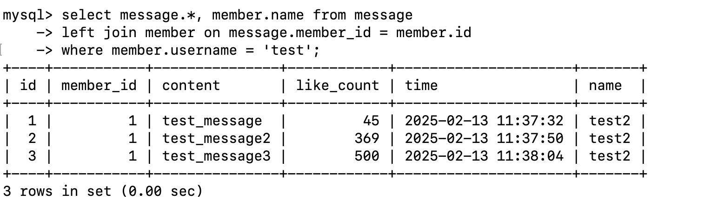

# Assignment - Week 5
## Task 2:Create database and table in your MySQL server 
- Create a new database named website.
```
create database website;
```


- Create a new table named member, in the website database, designed as below:

```
create table member(
    id bigint primary key auto_increment comment 'Unique ID',
    name varchar(255) not null comment 'Name',
    username varchar(255) not null comment 'Username',
    password varchar(255) not null comment 'Password',
    follower_count int unsigned not null default 0 comment 'Follower Count',
    time datetime not null default current_timestamp comment 'Signup Time'
);
```


## Task 3:SQL CRUD
- INSERT a new row to the member table where name, username and password must be set to test. INSERT additional 4 rows with arbitrary data.
```
insert into member(name, username, password) values('test', 'test', 'test');
insert into member(name, username, password) values('Abby', 'abby001', 'abc');
insert into member(name, username, password) values('Brian', 'brian001', 'bfd');
insert into member(name, username, password) values('LBJ', 'lbj001', '1234');
insert into member(name, username, password) values('MJ', 'mj001', '1235');
```

- SELECT all rows from the member table.
```
select * from member;
```

- SELECT all rows from the member table, in descending order of time.
```
select * from member order by time desc;
```

- SELECT total 3 rows, second to fourth, from the member table, in descending order of time. Note: it does not mean SELECT rows where id are 2, 3, or 4.
```
select * from member
order by time desc
limit 3 offset 1;
```

- SELECT rows where username equals to test.
```
select * from member where username='test';
```

- SELECT rows where name includes the es keyword.
```
select * from member where name like '%es%';
```

- SELECT rows where both username and password equal to test.
```
select * from member where username='test' and password='test';
```

- UPDATE data in name column to test2 where username equals to test.
```
update member set name='test2' where username='test';
```


## Task 4:SQL Aggregation Functions
- SELECT how many rows from the member table.
```
select count(*) from member;
```

- SELECT the sum of follower_count of all the rows from the member table.
```
select sum(follower_count) from member;
```

- SELECT the average of follower_count of all the rows from the member table.
```
select avg(follower_count) from member;
```

- SELECT the average of follower_count of the first 2 rows, in descending order of follower_count, from the member table.
```
select avg(follower_count) from(
    select follower_count from member 
    order by follower_count desc 
    limit 2) as top_2_follower_count;
```


## Task 5:Task 5: SQL JOIN
- Create a new table named message, in the website database. designed as below:
```
create table message(
    id bigint auto_increment comment 'Unique ID',
    member_id bigint not null comment 'Member ID for Message Sender',
    content varchar(255) not null comment 'Content',
    like_count int unsigned not null default 0 comment 'Like Count',
    time datetime not null default current_timestamp comment 'Publish Time',
    primary key (id),
    foreign key (member_id) references member(id)
);
```

- SELECT all messages, including sender names. We have to JOIN the member table
to get that.
```
select message.*, member.name from message
left join member on message.member_id = member.id;
```

- SELECT all messages, including sender names, where sender username equals to
test. We have to JOIN the member table to filter and get that.
```
select message.*, member.name from message
left join member on message.member_id = member.id
where member.username = 'test';
```

- Use SELECT, SQL Aggregation Functions with JOIN statement, get the average like
count of messages where sender username equals to test.
```
select avg(like_count) from message
inner join member on message.member_id = member.id
where member.username = 'test';
```

- Use SELECT, SQL Aggregation Functions with JOIN statement, get the average like
count of messages GROUP BY sender username.
```
select member.username, avg(like_count) from message
inner join member on message.member_id = member.id
group by member.username;
```
